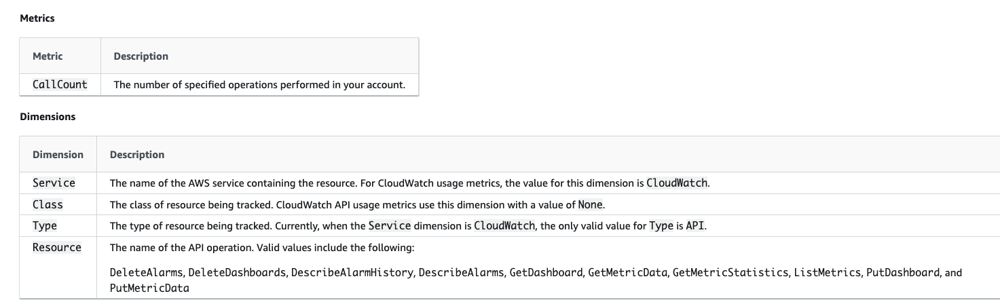

# cloudWatch-AWS
#Basic

1.CloudWatch 是什么？我们为什么要使用CloudWatch？
-------------------------------------------------
CloudWatch监控资源和应用程序，捕获日志并发送事件。
Amazon CloudWatch 会监控您的 Amazon Web Services (AWS) 资源以及您在上运行的应用程序AWS实时。您可以使用 CloudWatch 收集和跟踪指标，这些指标是您可衡量的相关资源和应用程序的变量。
CloudWatch 主页自动显示有关每个AWS您使用的服务。此外，您还可以创建自定义控制面板，以显示有关自定义应用程序的指标，并显示您选择的指标的自定义集合。
您可以创建警报，这些警报监视指标，当超出阈值时，它们会发送通知或者对您所监控的资源自动进行更改。
CloudWatch监控是保持AWS资源标签的标准机制。
CloudWatch提供了大量 指标和维度，使您可以创建基于时间的图形，警报和仪表盘。
警报是CloudWatch最实际的用法，允许您触发任何指定的指标。
警报可以触发SNS通知，Auto Scaling操作或EC2操作。
通过创建可自定义的仪表板视图来发布和共享指标图。
监视并报告EC2 实例系统检查失败警报。

CloudWatch的四大功能
指标：从AWS的服务中收集数据放到metrics,然后通过available statistics显示到控制台上
警报：通过对指标的判断，可以发出邮件，或执行auto scaling
日志：会将lambda/RDS等执行的日志放到log中，方便处理
对事件处理的功能：通过EC2实例或其他服务触发，调用到其他的服务，比如调用lambda

为什么要使用cloudwatch？
使用cloudwatch可以能让我们统一查看在 AWS 和本地服务器上运行的资源、应用程序和服务。您可以使用 CloudWatch 检测环境中的异常行为、设置警报、并排显示日志和指标、执行自动化操作、排查问题，以及发现可确保应用程序正常运行。

2.CloudWatch中的metrics是什么？包括哪些种类？我们可以如何使用metrics？
--------------------------------------------------------------
cloudWatch 会收集跟踪某些AWS资源的费用。这些指标与 AWS 服务配额对应。跟踪这些指标可帮助您主动管理配额。
指标是CloudWatch中的基本概念。 度量标准表示按时间顺序排列的一组数据点，这些数据点已发布到CloudWatch。 可以将指标视为要监视的变量，并将数据点表示为随时间推移该变量的值。

3.CloudWatch Events是什么？可以应用在那些场景。
----------------------------------------------------------------
CloudWatch Events 让您能够跟踪和响应 AWS 资源中的更改。您可以获得几乎实时的事件流，并使用规则将其路由到一个或多个目标 (AWS Lambda 函数、Amazon Kinesis 流、Amazon SNS 主题等)。生成的事件取决于特定的 AWS 服务。
以往，开发人员为了了解当前服务的健康状况，客户不得不自行编写脚本及工具，以低效的轮询方式调用各种管理API。随后，为了确定状态的变更，客户还要将当前信息与历史信息进行对比。为了让客户不必将时间再浪费在创建这种类型的工具上，亚马逊发布了 CloudWatch Events。
CloudWatch Events 可以监控系统中的各种行为，例如某个 EC2 实例的启动或关闭，并检测到自动伸缩事件的发生。CloudWatch Events 还能够检测到服务的设置或中止，包括 Amazon DynamoDB tables、 Amazon SNS topic 或 Amazon SQS.

相关概念理解：metrics，periods，namespace，dimensions，statistics。
